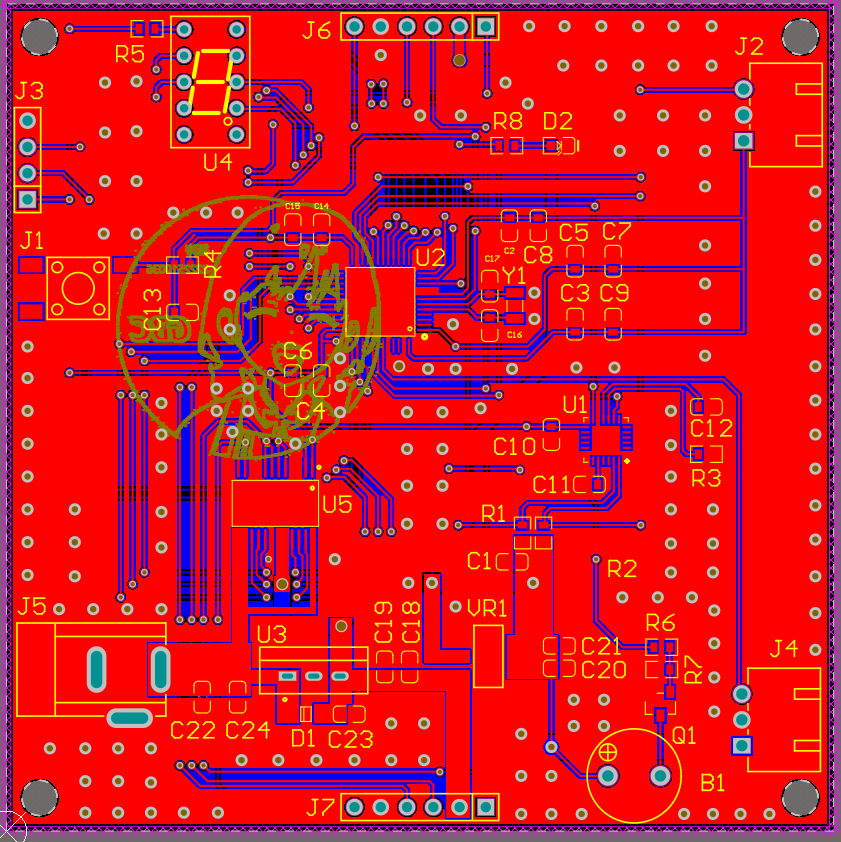
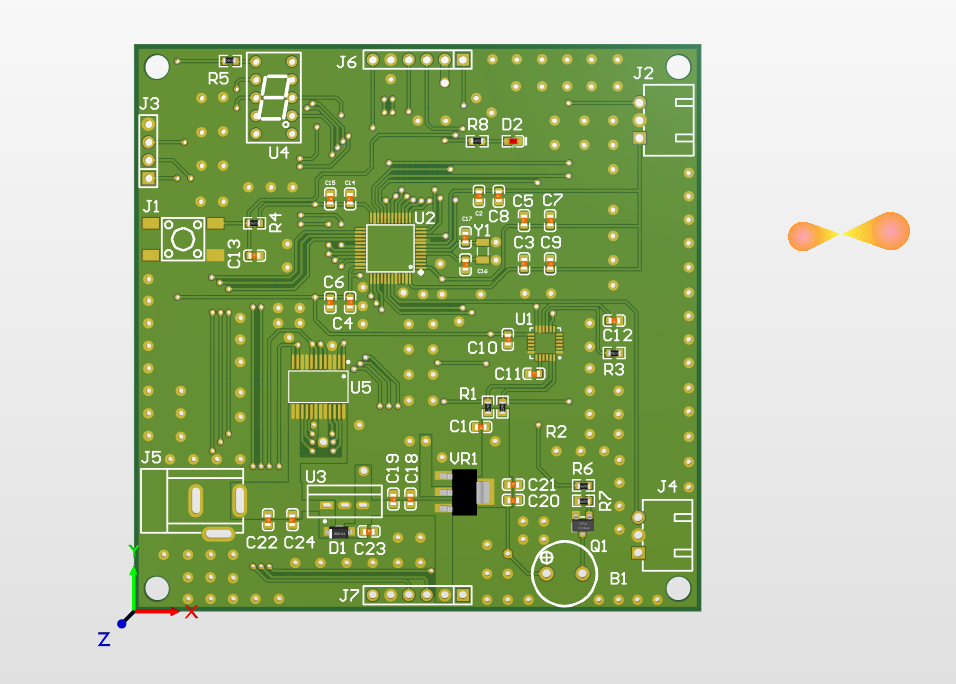
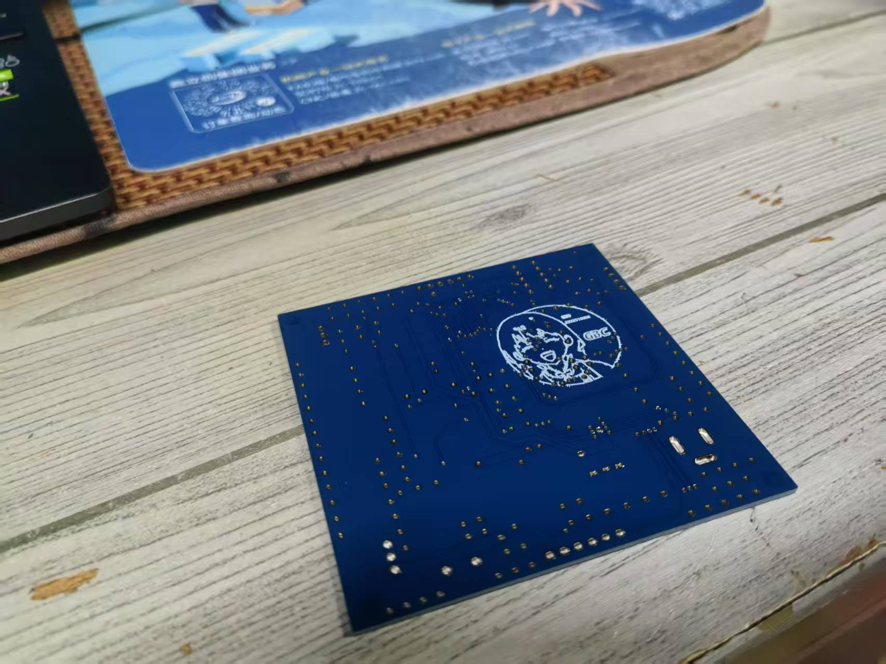
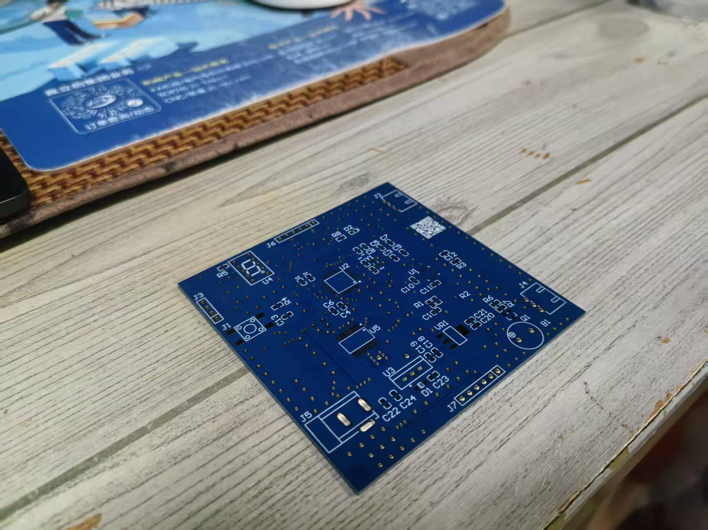

# STM32 双轮自平衡小车 (STM32 Two-Wheel Balancing Car)

这是一个基于 STM32F103C8T6 微控制器的双轮自平衡小车 PCB 设计项目，是我在学习嵌入式和 PCB 设计期间的一个实践作品。

### PCB 图预览

---

## 🌟 项目特色 (Features)

- **主控核心:** 采用经典的 **STM32F103C8T6** 作为主控制器。
- **姿态感知:** 使用 **MPU-6050** 六轴陀螺仪和加速度计，通过 I2C 接口实时获取小车姿态。
- **电机驱动:** 采用 **TB6612FNG** 驱动芯片，相比 L298N 效率更高、体积更小。
- **人机交互:**
  - 板载 LED 指示灯和蜂鸣器，用于状态提示和报警。
  - 集成一位共阳七段数码管，用于显示调试信息或模式状态。
  - 预留红外传感器模块接口，可用于循迹或避障功能扩展。
- **电源管理:** 支持 DC005 接口或排针接口输入，通过 LM2596 和 AMS1117-3.3 进行二次降压，为系统提供稳定的 5V 和 3.3V 供电。
- **调试接口:** 板载 SWD 下载调试接口，并预留了串口下载接口。

## 硬件清单 (Hardware Components)

| 模块/组件 (Module/Component) | 型号/规格 (Model/Specification) | 备注 (Notes)              |
| ---------------------------- | ------------------------------- | ------------------------- |
| **核心控制**                 |                                 |                           |
| 微控制器 (MCU)               | `STM32F103C8T6`                 | 主控制器                  |
| 姿态传感器 (IMU)             | `MPU-6050`                      | 六轴惯性测量单元          |
| **电源部分**                 |                                 |                           |
| 降压芯片 (Buck Converter)    | `LM2596-5.0`                    | 从 VCC_BAT 降压至 5V      |
| 线性稳压器 (LDO)             | `AMS1117-3.3`                   | 从 5V 降压至 3.3V         |
| **驱动与输出**               |                                 |                           |
| 电机驱动 (Motor Driver)      | `TB6612FNG`                     | 驱动两个直流减速电机      |
| 七段数码管 (7-Seg Display)   | `SM420561K` (共阳)              | 显示数据                  |
| 蜂鸣器 (Buzzer)              | `SOT封装无源蜂鸣器`             | 声音提示                  |
| LED 指示灯 (LED)             | `0805封装`                      | 电源或状态指示            |
| **接口部分**                 |                                 |                           |
| 调试接口 (Debug Port)        | `SWD`                           | ST-Link/J-Link 调试器接口 |
| 红外传感器接口               | `4-Pin`                         | 用于循迹/避障             |
